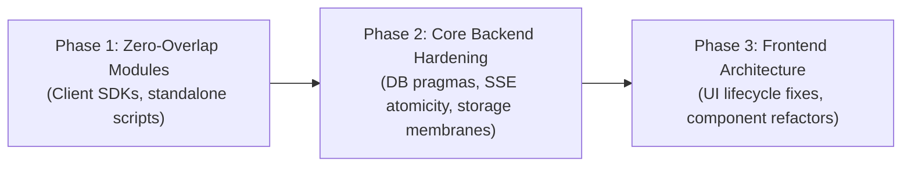

# Jules CLI Skill (Google Antigravity Edition)

This skill provides portable operational guidelines, verified CLI command syntax, prompt protocols, and asynchronous workflows for collaborating with **Google Jules CLI** inside the **Google Antigravity** framework.

---

## 🏛️ Architecture: Coordinator & Background Executor

In the **Google Antigravity** multi-agent paradigm:
- **Antigravity (Gemini / Claude)** operates as the **architect and coordinator**: mapping git topology, evaluating architectural constraints, constructing structured task plans, planting code annotations, and reviewing incoming patches.
- **Google Jules** operates as the **asynchronous background executor in an isolated VM**: writing code, executing automated test suites, resolving merge conflicts, and publishing GitHub Pull Requests.

---

## ⚖️ Local-First vs. Jules Delegation Decision Matrix

To optimize agent velocity and prevent excessive remote session creation, apply this triage rubric before dispatching:

| Criteria | Execute Locally (Antigravity) | Delegate to Google Jules |
| :--- | :--- | :--- |
| **Change Scope** | Small, localized fixes (< 50 lines, single file) | Large-scale, cross-file refactors or feature extractions |
| **Verification Cycle** | Instant lint/test checks (< 30 seconds) | Heavy, end-to-end test suites or extensive compile loops |
| **Environment Sensitivity** | Directly reproducible in local dev container | Benefits from pristine, isolated cloud VM environment |
| **Security & Pipelines** | **MANDATORY**: CI/CD workflows (`.github/workflows/**`), secrets, tokens | Application business logic, routers, components, unit tests |
| **Iteration Pacing** | Interactive step-by-step pair programming with human | Asynchronous, background execution while human focuses elsewhere |

---

## 🔑 Pre-Flight Validation & Environment Grounding

Before executing remote commands, run these deterministic checks to prevent TTY lockups or credential errors:

```bash
# 1. Verify OAuth credentials cache exists (avoids "GET request without valid client" in subshells)
test -f "$HOME/.jules/cache/oauth_creds.json" || { echo "OAuth cache missing. Run 'jules login' first."; exit 1; }

# 2. Auto-detect GitHub owner/repo slug cleanly (handles HTTPS and SSH git remotes)
REPO_SLUG=$(git remote get-url origin 2>/dev/null | sed -E 's#.*(github\.com)[/:]([^/]+/[^/.]+)(\.git)?#\2#')

# 3. Verify repository format: strictly GitHub owner/repo, NEVER local system $USER
echo "Targeting repository: $REPO_SLUG"
```

---

## 💻 Portable Jules CLI Command Reference

All interactions rely strictly on the standard `jules` CLI binary in the user's `PATH`.

### 1. Launch & Session Creation
```bash
# Launch interactive TUI
jules

# Create a session in current working directory's repository
jules new "task description or prompt"

# Create a session targeting a specific repository (strictly owner/repo)
jules new --repo "$REPO_SLUG" "task description"

# Non-interactive dispatch with TTY redirection (prevents TTY hang in automation)
jules new --repo "$REPO_SLUG" "task description" < /dev/null

# Stdin task piping directly from atomic task file (eliminates shell escaping errors)
cat .jules/tasks/task-1.md | jules new --repo "$REPO_SLUG" < /dev/null

# Launch multiple parallel exploration sessions
jules new --repo "$REPO_SLUG" --parallel 3 "task description"
```

### 2. Inspecting Remote Sessions
```bash
# List all remote sessions (displays: ID, Description, Repo, Last active, Status)
jules remote list --session

# List all repositories connected to Jules
jules remote list --repo

# Parse sessions into structured JSON without ID truncation using the PTY script:
./.agents/skills/jules-cli/scripts/parse_sessions.py

# Filter for sessions that have finished work and are awaiting review:
./.agents/skills/jules-cli/scripts/parse_sessions.py --status "Ready for review"
```

> [!TIP]
> **Extracting Full Session IDs (Overcoming Terminal Ellipsis Truncation):**  
> In standard terminal widths, `jules remote list --session` truncates 19–20 digit numeric session IDs with an ellipsis (e.g. `17983432046…`). Passing a truncated ID to subsequent commands triggers a `404 Not Found` API error.  
> Use `./.agents/skills/jules-cli/scripts/parse_sessions.py` or the direct Google Cloud REST API documented in [references/api-reference.md](./references/api-reference.md) to inspect un-truncated IDs and structured JSON activity streams.

### 3. Reviewing & Pulling Patches
```bash
# Inspect the remote diff without altering local files
jules remote pull --session <SESSION_ID>

# Apply the patch directly to the local workspace
jules remote pull --session <SESSION_ID> --apply

# Teleport: clones repo / checks out branch and applies session patch in one step
jules teleport <SESSION_ID>
```

### 4. Interactive Feedback & Follow-ups
The CLI does not currently support viewing conversational transcripts or submitting replies to active sessions directly via terminal arguments. When Jules pauses in `Awaiting User Feedback` or `Awaiting Plan Approval`:
1. **Ask the user to copy/paste the prompt/question Jules is waiting on**: Because CLI inspection only reveals git diffs and status, ask the user to copy whatever question, plan proposal, or review comment Jules posted in the Web UI.
2. **Formulate a grounded response prompt**: Analyze Jules's message, cross-reference it against the codebase and git state, and generate a precise, copy-pasteable prompt for the user.
3. **Provide the direct session link**:  
   **`https://jules.google.com/task/<SESSION_ID>`**
4. **User submission**: The user pastes the grounded prompt directly into Jules's web chat to steer or unblock Jules.

---

## 🔍 Proactive Task Discovery: The `// TODO:` Scanner

Jules features an autonomous **Suggested Tasks** capability controlled by its "proactivity" toggle.

### How It Operates
- Jules actively parses repository source code specifically scanning for **inline `#TODO` or `// TODO:` comments** (e.g., `// TODO: handle edge case`).
- *Per documentation:* **"Jules focuses on identifying #TODO comments in your code. It reads the context, formulates a plan, and presents it for your approval."**
- It does **not** scan standalone static markdown files like `TODO.md` or `TODO.txt` for this feature.

### Antigravity Proactive Steering Protocol
Antigravity agents can proactively direct Jules's task pipeline without manual ticketing:
1. Audit the repository for technical debt, unhandled errors, or architectural boundary violations (such as files exceeding file-length guidelines).
2. Insert scoped, actionable `// TODO:` comments directly above target modules, handlers, or components.
3. When Jules executes its next background repo sweep, it automatically ingests these comments, synthesizes execution plans, and generates task cards for user review.

> 📖 *For complete comment formats, language syntax, and examples, see [references/suggested-tasks.md](./references/suggested-tasks.md).*

---

## 🛡️ Git Grounding & Hallucination Defenses

Because Jules operates in an isolated container VM, complex branching trees or merge histories can occasionally cause it to misinterpret the repository topology (e.g. assuming a branch is empty if inspecting merge commits without traversing tree objects).

Always ground Jules prompts with explicit git invariants:
1. **Specify the active base branch** (e.g., `main`).
2. **Provide tree verification commands**: Instruct Jules to run `git ls-tree -r --name-only HEAD` before modifying files to verify code presence.
3. **Set negative guardrails**: Explicitly state: *"DO NOT force-reset, rebase root, or force-push `main`."*

### 📝 The 4-Component Battle-Tested Prompt Formula
Every `jules new` prompt should follow this verified atomic structure:
```text
"First, verify repository files using git ls-tree -r --name-only HEAD on branch main. DO NOT force-reset or force-push main. Next, read .jules/JULES.md for fleet rules, then execute your assigned task in .jules/tasks/task-N.md. [Scoped file targets, boundary conditions, and line constraints]. Verify with npm run lint, npm run build, and npm test before opening a Pull Request."
```

> 📖 *For multi-PR consolidation strategies and PTY terminal tricks, see [references/git-topology.md](./references/git-topology.md).*

---

## 🚀 Multi-Session Fleet Concurrency & Quota Tiers

Google Jules supports tiered daily and concurrent execution quotas:

| Plan Tier | Daily Sessions | Concurrent Sessions | Best For |
| :--- | :--- | :--- | :--- |
| **Free** | 15 / day | **3 concurrent** | Quick single-file fixes, small bug investigations |
| **Pro** | 100 / day | **15 concurrent** | Parallel feature decomposition, multi-domain sweeps |
| **Ultra** | 300 / day | **60 concurrent** | Massive full-codebase refactors, fleet modernization |

### Conversational Concurrency Calibration Protocol
Never assume or impose tier limits onto the developer arbitrarily. Before triggering a batch dispatch:
- **Ask the user how many sessions they want to do concurrently**: Solicit their desired concurrency so delegation feels smooth, natural, and tuned to their active workflow pacing rather than forced by tier limits.
- **Calibrate the fleet to their target**: Once confirmed (e.g. 7 tasks across the Pro allowance), launch that exact batch size across isolated container VMs.

### 1. Orthogonal Architectural Domain Partitioning
When launching multiple concurrent sessions targeting the same repository, **each task must be partitioned into an isolated architectural domain**. If multiple sessions attempt to refactor the same functions or contiguous lines on separate branches simultaneously, merging their PRs later will produce complex git merge conflicts.

Partition work across non-overlapping domains:
- **Backend Router Decomposition**: Extract route controllers into dedicated modules (`src/server/routes/`).
- **Frontend Component Decomposition**: Extract complex screens into sub-features (`src/features/<feature>/`).
- **Storage & Upload Membranes**: Independent middleware and limits (`storageRouter.ts`, `multer` options).
- **Maintenance & Backup Utilities**: Standalone operational scripts (`src/server/utils/backup.ts`).
- **Database Pragmas & Event Atomicity**: Connection configuration and transaction lifecycle hooks (`src/server/db.ts`).
- **Frontend Primitives & Lifecycle**: Isolated UI widgets and context providers (`components/ui/`, `ToastContext.tsx`).
- **Client SDK**: Separate library packaging and network clients (`sdk/src/`).

### 2. Immediate Session Metadata & URL Capture
The output of `jules new` immediately prints the complete 19–20 digit numeric Session ID and direct web session URL on stdout:
```text
Using repository from working directory: Owner/Repo
Session is created.
ID: 13435142300694340266
Task: ...
URL: https://jules.google.com/session/13435142300694340266
```
Unlike `jules remote list --session` (which truncates IDs with an ellipsis in standard terminal viewports), `jules new` provides the full raw ID. Always capture and present both the Session ID and direct link (`https://jules.google.com/session/<ID>`) immediately upon dispatch.

---

## 🎯 Dual-Channel Steering: Pairing Inline `// TODO:` with Task Plans

Jules ingests work through two complementary channels:
1. **The Background Proactivity Scanner**: Sweeps repository code periodically for inline `// TODO(category): description \n// Constraints: ...` comments to generate "Suggested Tasks" cards.
2. **Explicit CLI / Web Prompts**: Targeted dispatches via `jules new` or direct user prompts.

### The Dual-Channel Pairing Protocol
For maximum reliability, ensure that **every task defined in `.jules/tasks/jules-task-plan.md` has matching structured `// TODO:` comments planted directly above the target code blocks**:

```typescript
// TODO(security): Enforce strict upload file size limit and validate MIME types / magic-bytes in Multer
// Constraints: Set limits: { fileSize: 50 * 1024 * 1024 } (50MB) and configure fileFilter validating MIME types.
```

Benefits:
- **Double Anchoring**: Jules's LLM planner has full context from both the comprehensive task plan markdown and the pinpoint inline code annotations.
- **Proactive Fallback**: If a developer accesses the Jules Web UI instead of the CLI, the exact same tasks are already queued in the "Suggested Tasks" pane.
- **Dynamic Task Plan Invalidation**: When another agent (e.g. Sentinel) or a developer resolves an issue, mark it `[COMPLETED ✅]` in `.jules/tasks/jules-task-plan.md` and commit to `main` before dispatching so Jules never duplicates effort or fights existing fixes.

---

## 🔄 GitHub CI Integration & Autonomous "CI Fixer"

Jules features native webhook integration with GitHub Actions Check Suites via its GitHub App (`google-labs-jules[bot]`).

### How CI-Driven Self-Repair Works
1. **Pull Request Trigger**: When Jules opens a pull request or updates a branch targeting `main`, GitHub Actions automatically triggers all workflows configured with `on: pull_request:`.
2. **Webhook Notification**: If a CI check fails (e.g. Lint, E2E Test Suite, Docker Build), GitHub instantly fires a `check_suite.completed` webhook to Jules.
3. **Autonomous "CI Fixer" Wakeup**:
   - The Jules Web UI displays: `Check Suite Failure: 1 check failed. Jules has been notified.`
   - Even if Jules had previously marked the task as `Ready for review` or `Completed`, Jules's **CI Fixer** autonomously transitions back into `Planning` or `In Progress`.
   - Jules ingests the exact error logs from GitHub Actions, identifies the failed steps, and applies corrective edits inside its VM.
4. **Automated Re-commit & Verification**: Jules commits the fix, pushes to the PR branch, and triggers a fresh CI run until the check suite passes green.

### Operational Rule for Antigravity Agents
- **Do Not Intervene While CI Fixer Is Active**: When an agent detects a CI check failure on a Jules PR, do NOT push competing commits or force-reset the branch. Jules is already actively self-healing.
- **Monitor the Repair Pass**: Inspect Jules's corrective edits using `jules remote pull --session <SESSION_ID>`.
- **Intervene Only on Escalation**: Only formulate a manual guidance prompt if Jules exhausts its retries, asks a clarifying question, or transitions into `Awaiting User Feedback`.

> 📖 *For failure patterns, webhook lifecycle, and runner troubleshooting, see [references/ci-fixer.md](./references/ci-fixer.md).*

---

## 📋 The 4-Step Delegation Protocol

### Step 1: Context Preparation & Atomic Task Creation
1. Maintain `.jules/JULES.md` as the malleable, global fleet briefing (repository invariants, tech stack, verification commands, and file length ceilings).
2. Author isolated, dedicated task files in `.jules/tasks/task-<N>.md` (one file per task). Each file details the target file paths, specific problem statement, desired architectural shape, and acceptance criteria.
3. Commit `.jules/JULES.md` and the `.jules/tasks/task-<N>.md` files to `main` before launching the fleet so every container VM pulls the latest task specifications.

### Step 2: Offload Tasks via Jules CLI (Single or Fleet)
1. **Calibrate Concurrency**: If planning a fleet dispatch, prompt the user for their desired concurrent session count to keep delegation natural and aligned with their workflow pacing and plan tier (Free: 3, Pro: 15, Ultra: 60 concurrent).
2. **Dispatch with Prompt Formula**: When dispatching with `jules new`, use the atomic prompt formula:

```bash
# Single task dispatch
jules new "First, verify repository files using git ls-tree -r --name-only HEAD on branch main. DO NOT force-reset or force-push main. Next, read .jules/JULES.md for fleet rules, then execute your assigned task in .jules/tasks/task-1.md. Verify with npm run lint, npm run build, and npm test before opening a Pull Request."

# Fleet dispatch: Launch multiple orthogonal tasks in rapid succession
jules new "First, verify repository files... Read .jules/JULES.md... execute .jules/tasks/task-1.md..."
jules new "First, verify repository files... Read .jules/JULES.md... execute .jules/tasks/task-2.md..."
jules new "First, verify repository files... Read .jules/JULES.md... execute .jules/tasks/task-3.md..."
```
Capture and record the returned Session ID and URL immediately from the CLI output.

### Step 3: Monitor & Guide Execution
1. Periodically check fleet progress via `jules remote list --session`.
2. Inspect ongoing code diffs using `jules remote pull --session <SESSION_ID>`.
3. When Jules enters `Awaiting User Feedback` or `Awaiting Plan Approval`:
   - Ask the user to copy/paste the question or plan Jules posted in the Web UI.
   - Analyze Jules's input and produce a clear, grounded copy-paste prompt.
   - Provide the direct URL (`https://jules.google.com/session/<SESSION_ID>`).

### Step 4: Fleet Audit & 3-Phase Reconciliation

When a fleet lands with multiple pull requests, never merge them arbitrarily. Follow the 3-phase dependency hierarchy:



1. **Phase 1: Zero-Overlap Modules**:
   - Merge standalone packages (e.g. `sdk/`) and operational scripts (e.g. `backup.ts`) first.
   - These touch zero core backend or UI files, establishing an immediate, clean green baseline.
2. **Phase 2: Core Backend Hardening & Data Membranes**:
   - Merge database configuration (`busy_timeout`), event bus atomicity (deferred post-commit SSE), and middleware limits (`multer` 50MB limits, magic-byte guards).
   - Verify server routes still compile before touching frontend code.
3. **Phase 3: Frontend Architecture & Competing Refactor Resolution**:
   - Merge frontend lifecycle fixes (e.g. `NaN` guards, unmount timer cleanup).
   - **Competing Refactor Protocol**: If multiple sessions refactored the same monolith (e.g. two alternative decompositions of `TableEditor.tsx`):
     - Compare component hierarchy, hook isolation, and line count against the project's granularity ceiling (~250-line target, 500-line hard ceiling).
     - Merge the superior architecture.
     - Port any independent fixes landed by competing or adjacent PRs (e.g. `AbortController` cancellation).
     - Explicitly close superseded PRs with a comment explaining the architectural rationale to maintain **zero open PR debt**.
4. **CI & Verification Ratification**:
   - Run `npm run lint` and `npm run build` locally.
   - Monitor remote GitHub Actions check suites on `main` until CI and Docker workflows pass 100% green.
   - Verify that `gh pr list --state open` reports **0 open PRs**.

---

## 🔒 Inviolable Security Redlines

1. **NEVER delegate CI/CD workflow edits**: Neither Antigravity nor Google Jules may create, modify, or delete files under `.github/workflows/`. All pipeline changes must be authored directly by project maintainers.
2. **NEVER force-push or rewrite git history**: Never pass instructions or commands that perform `git push --force`, `git reset --hard`, or rebase `main`.
3. **NEVER touch secrets or environment files**: Keep `.env`, `.env.*`, and secret credentials strictly outside of Jules prompts, task files, and commits.

---

## 📚 References & Tooling Assets

- 🌐 [references/api-reference.md](./references/api-reference.md) — Complete Google Jules REST API reference (`v1alpha/sessions`), payload schemas, and `/activities` stream.
- 📋 [references/task-templates.md](./references/task-templates.md) — Battle-tested prompt templates for Unit Tests, Component Decomposition, and Security Remediation.
- 🔍 [references/suggested-tasks.md](./references/suggested-tasks.md) — Syntax rules and examples for inline `// TODO:` task discovery.
- 🌳 [references/git-topology.md](./references/git-topology.md) — Git tree grounding invariants and multi-PR branch reconciliation.
- 🔄 [references/ci-fixer.md](./references/ci-fixer.md) — Autonomous CI Fixer webhook lifecycle and check-suite debugging.
- 🐍 [scripts/parse_sessions.py](./scripts/parse_sessions.py) — Standalone PTY script to parse `jules remote list --session` into structured JSON.