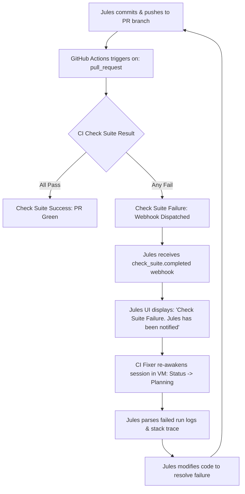

# Reference: GitHub CI Integration & Autonomous "CI Fixer"

This reference document details the technical mechanics, event lifecycle, and operational protocols for **Google Jules's CI Fixer** integration with GitHub Actions.

---

## 1. Architectural Overview

Jules operates as an autonomous background engineer connected to GitHub repositories via the official GitHub App (`google-labs-jules[bot]`). 

While Jules verifies code locally inside its ephemeral container VM using whatever test scripts it discovers, remote GitHub Actions workflows execute in clean runner environments. The **CI Fixer** bridges this boundary:

---

## 2. Check Suite Webhook Mechanics

When a pull request branch receives a commit:
1. GitHub executes all workflows defined with `on: pull_request:`.
2. When any job fails (e.g., `Lint & Build`, `E2E Suite`, `Docker Build`), GitHub publishes a `check_suite.completed` event with conclusion `failure`.
3. The Jules backend webhook handler ingests the failure payload:
   - Workflow name and Job name.
   - Step that failed.
   - Extracted run log output and error messages.
4. If **CI Fixer** is enabled in repository settings (configured under *"⚙️ CI Fixer Settings"* in the Jules UI), Jules automatically launches a corrective iteration.

---

## 3. Real-World Failure Patterns & How Jules Fixes Them

### Pattern A: Merge Conflict Markers Left in Artifacts
- **Symptom**: During multi-branch merges, conflict markers (`<<<<<<< HEAD`, `=======`, `>>>>>>>`) accidentally get committed to non-code files (e.g. `Dockerfile`, YAML configurations).
- **CI Failure**: Docker Build or linter fails on invalid syntax.
- **Jules Behavior**: Jules identifies the syntax error from the Docker Build log, opens the file, strips the markers, picks the winning version, and pushes an updated commit.

### Pattern B: Transitive Dependency Incompatibilities
- **Symptom**: Dependabot bumps update a library that requires a newer peer dependency or Node engine version.
- **CI Failure**: `npm ci` or `npm test` throws `ERESOLVE` or engine warnings.
- **Jules Behavior**: Jules adjusts `package.json` constraints or aligns peer dependencies.

### Pattern C: Local vs. CI Environment Divergence
- **Symptom**: A test passes locally because a file was pre-existing or cached, but fails in the clean CI runner.
- **CI Failure**: E2E or test suite step fails with `ENOENT` or `ECONNREFUSED`.
- **Jules Behavior**: Jules inspects the runner initialization sequence in `.github/workflows/*.yml` and adjusts timing or setup steps.

---

## 4. Operational Best Practices for Antigravity Agents

1. **Do Not Interfere with In-Flight Fixes**:
   When an Antigravity agent notices a CI check failure on a Jules PR, **do not** immediately push commits to that branch or recreate the PR. Jules's CI Fixer is already alerted and working.
2. **Track State via CLI**:
   Run `jules remote list --session` to monitor status. A session shifting from `Completed` to `Planning` confirms CI Fixer is active.
3. **Inspect Corrective Diff**:
   Use `jules remote pull --session <SESSION_ID>` to verify that Jules's corrective commits resolve the root cause without introducing regressions.
4. **When to Intervene**:
   Only intervene if:
   - The session enters `Awaiting User Feedback` or `Awaiting Plan Approval`.
   - The CI Fixer exhausts its automated attempt budget without resolving the error.
