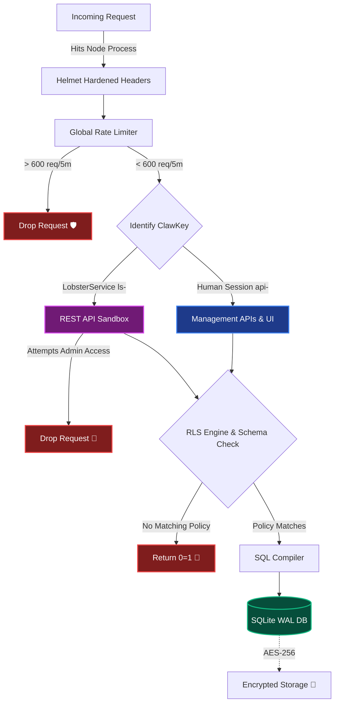

# 🦞 CaraBase Security Architecture & Invariants

  
> **Maintained by CrustAgent©™ for ClawStack Studios©™**

Welcome to the CaraBase Security Protocol. We do not hunt for theoretical shadows. Instead, we define the absolute, unyielding constraints of our system. By defining exactly what **cannot** happen, we constrain the actual attack surface to only what remains.

---

## Configuration Hygiene & Leakage Prevention
- **Secrets Management**: All secrets are externalized via environment variables or vaults. No plain-text secrets in code.
- **Error Handling**: Production errors return generic messages; stack traces are logged securely.
- **Header Hardening**: Server identification headers are stripped; security headers are enforced.
- **Dead Code Removal**: Quarterly audits remove unused configuration properties and legacy endpoints.

---

## 🗺️ The Defensive Topology

This diagram maps the flow of a request as it attempts to cross our defensive bridges.

---

## 🏗️ Structural Integrity

<b>The ClawKeys©™ Implementation</b>

* All public endpoints utilizing API tokens must explicitly enforce dynamic parameterized queries to guard against SQL injection.
* **Private LobsterService Keys (`ls-p-`)** have implicit administrative bypass authority for RLS mappings and MUST be rotated if exposed.
* **Anon Public Keys (`ls-`)** MUST evaluate `_carabase_policies` logic on every single invocation hitting `/rest/v1`. If zero policies exist for a table, the access evaluates to `DENY ALL`.

<b>Internal System Protection</b>

1. `req.params.table` mapping must ALWAYS pass through regex sanitization stripping all non-alphanumeric/underscore characteristics.
2. The core internal system tracking tables: `_carabase_api_keys` and `_carabase_policies` are hard-blocked from public HTTP API exposure.
3. Parameter injection requires direct generic `?` bounds tracking. We do NOT use string interpolation for SQL queries passing user values.

---

## 🛡️ The 8 Absolute Invariants

These are the non-negotiable truths of the system—the constraint levers we control. 

<b>1. The Lobster Sandbox Invariant 🦀</b>

> **The Constraint:** LobsterKeys (`lb-`), acting on behalf of humans, can **never** access `/api/admin` or `/api/system` routes. 
> **The Attack Surface:** Even if a LobsterKey is stolen, leaked, or goes rogue with "ALL" permissions, it is physically impossible for it to manage backups, alter the API builder, or drop system tables. The only surface that can reach system APIs is a human session (`api-`) authenticated via the ClawKeys UI login flow.

<b>2. The RLS Fail-Closed Invariant 🛑</b>

> **The Constraint:** The Row-Level Security parser (`applyRls()`) defaults to returning `"0=1"` if no policy explicitly grants access.
> **The Attack Surface:** If the security engine encounters a query it doesn't understand, or a table with no policies, it defaults to absolute zero. Attackers cannot bypass RLS by sending malformed payloads; the bridge must be explicitly built for data to cross it.

<b>3. The Timing Attack Immunity Invariant ⏱️</b>

> **The Constraint:** Every single authentication token, Agent key, and human password comparison uses `crypto.timingSafeEqual()`.
> **The Attack Surface:** An attacker cannot slowly guess a token character-by-character by measuring how many milliseconds the server takes to reject the request. The comparison takes the exact same amount of time regardless of input, neutralizing timing-based inference attacks.

<b>4. The Global Exhaustion Invariant 🛡️</b>

> **The Constraint:** The global in-memory rate limiter enforces a hard ceiling (600 requests / 5 minutes per IP) before hitting any application logic.
> **The Attack Surface:** The Node event loop is protected from being flooded. Basic DDoS resource exhaustion and brute-force password guessing are mitigated at the boundary layer before they can strain the database.

<b>5. The Dynamic Schema Isolation Invariant 🏗️</b>

> **The Constraint:** Dynamic table creation in the API Builder strictly tests inputs against `/^[a-zA-Z0-9_]+$/`.
> **The Attack Surface:** Because CaraBase allows users to dynamically generate SQLite tables via a UI, this is the prime target for SQL injection. This regex invariant ensures no drop commands or malformed strings can ever reach the `db.exec()` compiler. The attack surface for schema injection is effectively closed.

<b>6. The Encryption-at-Rest Invariant 🔐</b>

> **The Constraint:** The `carabase.sqlite` file is wrapped by `sqlcipher` using the `DB_ENCRYPTION_KEY`.
> **The Attack Surface:** If someone bypasses the application entirely and gains access to the raw Docker volume, or steals the backup file out of the `/data/backups/` directory, the SQLite file is completely illegible binary garbage without the environment key.

<b>7. The Process Resilience Invariant (The Hard Shell) 🐢</b>

> **The Constraint:** The frontend sits behind a global `ErrorBoundary`, and Express routes sit behind a global error-catching middleware that logs to `audit_logs`.
> **The Attack Surface:** An attacker cannot intentionally crash the application by sending malformed data that triggers an unhandled exception. It fails gracefully, logs the event, and keeps the engine running—denying Denial of Service via application panic.

<b>8. The Header Hardening Invariant 🪖</b>

> **The Constraint:** Helmet explicitly blocks MIME-sniffing, enables XSS filters, forces Strict-Transport-Security (HSTS), and restricts `frameAncestors` to `'self'` in production.
> **The Attack Surface:** The browser is explicitly instructed never to load CaraBase inside an iframe on another domain (neutralizing Clickjacking), and to aggressively reject injected scripts (mitigating XSS).

  

---

*CaraBase aims to guarantee these 8 invariants are structurally impenetrable in a Self-Hosted production environment, running in a Docker containerized deployment.*

*CaraBase is not intended as a SaaS for commercial purposes, but as a product to be deployed on prem, and used by anyone who wants a self hosted BaaS style database in their preferred infrastructure. ClawStack Studios is not responsible for any data loss that may occur due to user misuse, negligence, or deployment factors outside of our control. By deploying and using CaraBase, you agree to be responsible for the security of your data and your CaraBase instance.*