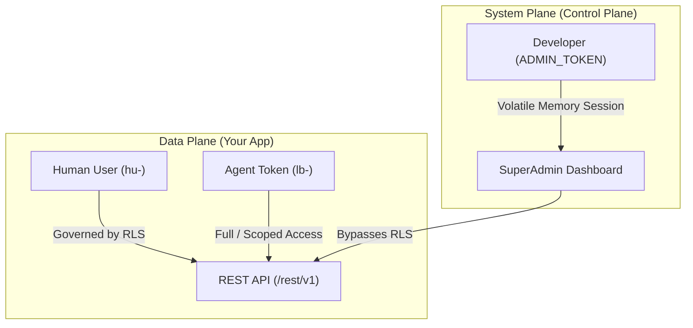

<div class="vp-doc">

<div style="margin: 4rem auto; max-width: 1000px; padding: 0 20px;">
  
</div>

## Explore the Documentation

<CardGrid cols="3">
  <Card title="Getting Started" href="/quickstart" icon="🚀" tag="Guide">
    Generate your secrets, launch the Docker container, and complete the 5-minute setup wizard.
  </Card>
  <Card title="Database & Tables" href="/tables" icon="🗃️" tag="Database">
    Visual Table Editor, SQL Editor, Views, Indexes, and Triggers.
  </Card>
  <Card title="Row-Level Security" href="/rls" icon="🛡️" tag="Security">
    Protect your REST API with policy expressions evaluated statically at the connection layer.
  </Card>
  <Card title="Storage Engine" href="/storage" icon="📦" tag="Storage">
    Secure file uploads with Magic Bytes inspection, dangerous MIME guards, and cryptographic share links.
  </Card>
  <Card title="Custom API Builder" href="/api-builder" icon="⚙️" tag="API">
    Map dynamic SQLite queries to standard REST GET endpoints directly from the dashboard.
  </Card>
  <Card title="Client Libraries" href="/react-integration" icon="💻" tag="SDK">
    Integrate the fully-typed JS/TS SDK into React or hook up a custom Android Kotlin client.
  </Card>
</CardGrid>

---

## The Three Doors of Access



---

## 3-Step Rapid Onboarding

<Steps>
  <Step title="1. Generate Your Secrets" number="1">

Generate your master database encryption key and SuperAdmin token:

```bash
# Generate 256-bit DB Encryption Key (SQLCipher)
openssl rand -hex 32

# Generate secure SuperAdmin Token
openssl rand -hex 24
```
  </Step>

  <Step title="2. Launch the Container" number="2">

Create a `docker-compose.yml` file:

```yaml
services:
  carabase:
    image: ghcr.io/clawstackstudios/carabase:latest
    ports:
      - "5353:5353"
    environment:
      - DB_ENCRYPTION_KEY=YOUR_GENERATED_KEY
      - ADMIN_TOKEN=YOUR_GENERATED_ADMIN_TOKEN
    volumes:
      - ./data:/app/data
```

Launch the stack:

```bash
docker compose up -d
```
  </Step>

  <Step title="3. Complete the Setup Wizard" number="3">

Open http://localhost:5353 in your web browser. 

You'll be redirected to the Setup Wizard. Enter your `ADMIN_TOKEN` to provision the foundational `superlobster` account, and you'll immediately land in the CaraBase SuperAdmin dashboard where you can start creating tables.
  </Step>
</Steps>

</div>
